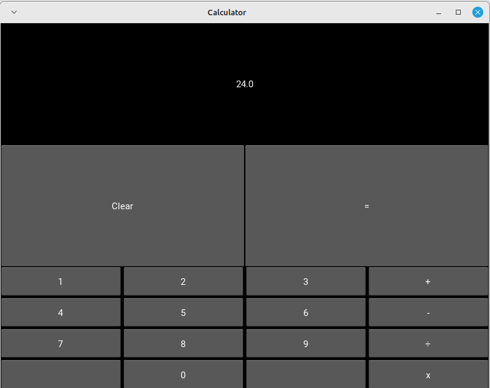

# Calculadora-Kivy

Uma calculadora simples feito utilizando Python e a biblioteca Kivy.

## Funcionalidades

    Use os operadores básicos e calcule, teste seus conhecimentos.

## Pré-requisitos

### Certifique-se de ter o seguinte instalado antes de começar:
  
     Python 3
     Kivy

## Instalação e Uso

1. Baixe de acordo com sua plataforma:

    - Windows x64: 
    - Linux x86_64: 
    - Apk: Em breve.

2. Ou siga os seguintes passos:

- Clone o repositório:

        git clone https://github.com/Louiexz/Calculadora-Kivy.git
        cd Calculadora-Kivy
 
 - Instale as dependências:

        pip install -r requirements.txt

 - Execute o aplicativo:

        python run.py

## Estrutura do Projeto

    Calculadora-Kivy/
    │
    ├── run.py           # Arquivo principal do aplicativo
    ├── assets/             # Diretório contendo arquivos necessários
    |   ├── scripts/           # Diretório contendo pastas de funções e/ou classes
    │   │   ├── main/              # Pasta principal
    |   |   |   ├── calculator.kv     # Interface da calculadora
    |   |   |   └── calculator.py     # Chamadas de funções
    │   |   └── functs/            # Funções necessárias
    |   |       ├── keyboard.py       # Entrada e saída de keyboard 
    |   |       └── operations.py     # Tratamento de cálculos
    |   └── images/         # Diretório contendo images
    │       └── icon/          # Pasta com ícone da calculadora
    └── requirements.txt  # Arquivo contendo as dependências do Python

## Contribuições
Louiexz - Autor e Desenvolvedor da Calculadora 

Contribuições são bem-vindas! Sinta-se à vontade para abrir issues ou pull requests.